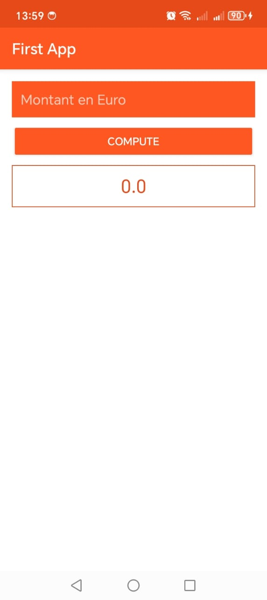
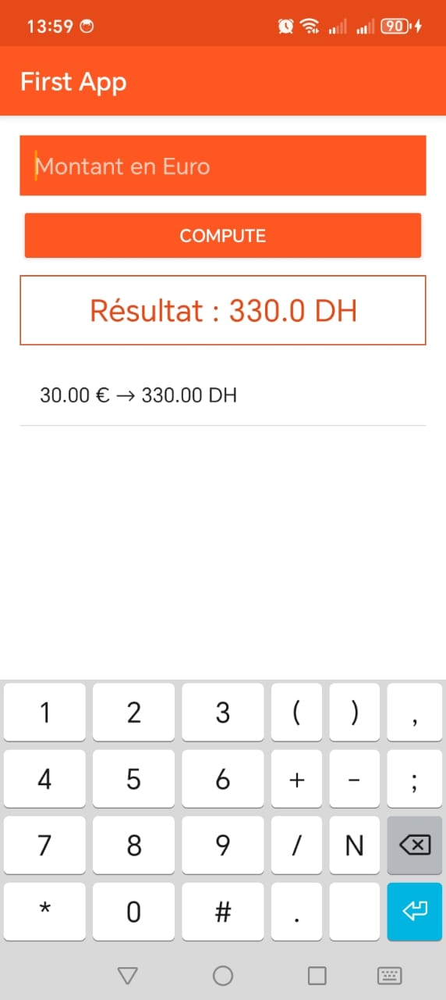
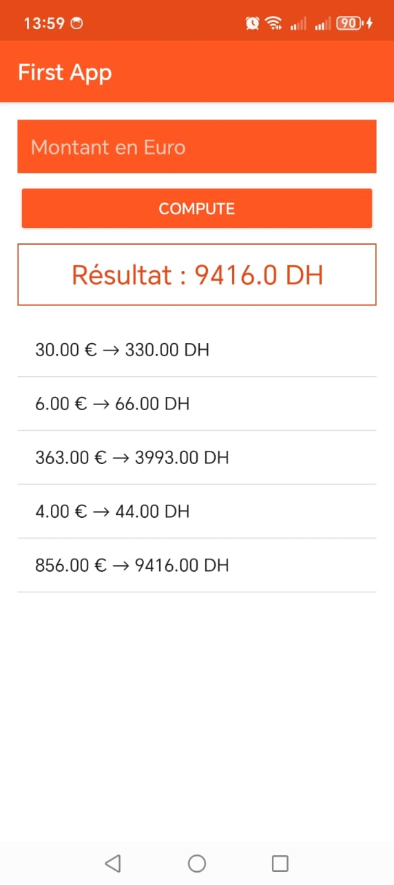

# 📱 Convertisseur Euro vers Dirham (DH)

Une application Android simple et intuitive permettant de convertir des montants en Euro (€) vers Dirham marocain (DH) avec un taux fixe, tout en gardant un historique de conversion.

---

## 🖼️ Captures d’écran

| Entrée de montant | Résultat affiché | Historique |
|-------------------|------------------|------------|
|  |  |  |

> 📁 Place tes images dans un dossier `screenshots/` dans ton projet.

---

## ✨ Fonctionnalités

- ✅ Saisie du montant en Euro via un champ `EditText`
- 🔁 Conversion automatique en Dirham (1 € = 11 DH)
- 🧾 Affichage du résultat formaté
- 📋 Historique dynamique de toutes les conversions
- 🎨 Interface moderne (Material Design, couleurs orange et blanc)
- ⚠️ Gestion des montants invalides ou vides

---

## 🛠️ Technologies utilisées

- **Kotlin**
- **Android SDK**
- **AppCompat + ViewBinding**
- UI en **XML**
- Aucun framework externe (léger et rapide)

---

## 🚀 Installation & utilisation

1. **Clone le dépôt**
   ```bash
   git clone https://github.com/LAMBARAA-Abdellah/convertisseur-euro
   cd convertisseur-euro
